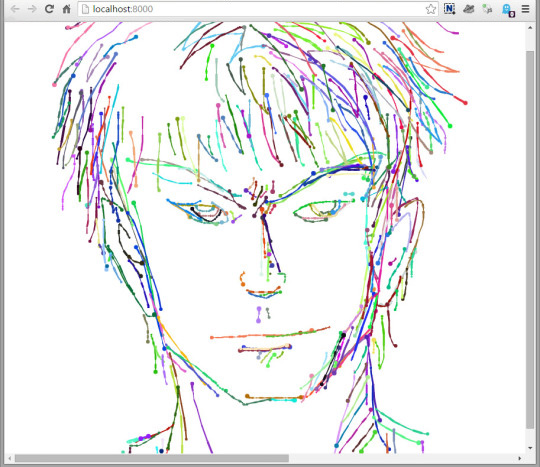

# Sketch.2

A web drawing app made with P5, canvas, and Babel for ES6 features. Currently allows you to draw rainbow strokes, and move them around on an infinite canvas.

## Screenshot

## Building

This app uses webpack and gulp to build. Run
    
    npm install

and then 
    
    gulp

and the app should live on `localhost:8000`.

## Usage

Use the mouse to draw strokes (color chosen randomly).

There are a few keyboard commands, primarily for testing:

Press `X` to switch to View Mode, where the mouse is used to shift the canvas, and can be used to draw in new locations.

Press `B` to return to Brush Mode and draw.

Press `R` to reset the canvas back to its original point.

### Switching brushes

Several brushes have been implemented, found under `src/brushes`. To switch between available brushes, go to the file `src/tools/drawing/brushTool.js` and edit the brush being used for `this.currentStroke` in the onMousePressed() event. (You can change colors in a similar manner.) 

This was hardcoded for the purposes of demo, although at some point a better interface or UI might replace it.

## TODO:

I'm not consistently working on this. Nevertheless, here's a list of features I'd like to add:

* User control over colors, brush shape, thickness, etc.
* UI to switch brushes
* Image import / export
* Layers (layer support exists, but currently is impossible to create additional layers)
* Animated brushes using P5 (a poorly-working example is given)